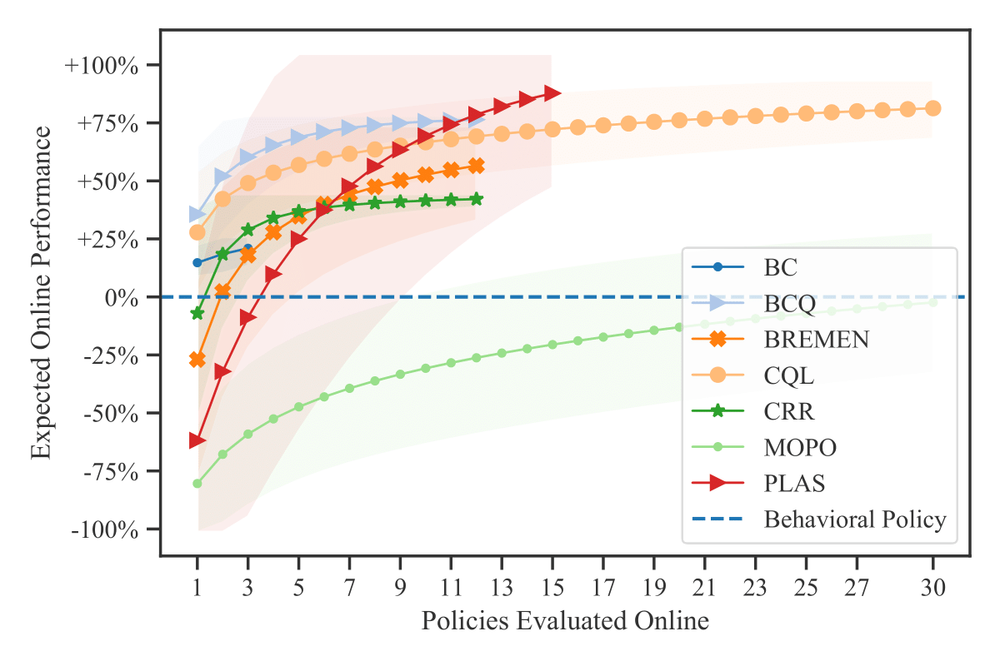

# Expected Online Performance

Code Release for [Showing Your Offline Reinforcement Learning Work: Online Evaluation Budget Matters](https://arxiv.org/abs/2110.04156). The repository contains both [implementation of the proposed technique](eop.py) and all the necessary details for reproducing the experiments presented in the paper.

<figure align="center">

<figcaption><b>Expected Online Performance</b> graph for Walker2D-L-1000 dataset.</figcaption>
</figure>

## How to use EOP?

```python
from eop import expected_online_performance

# How many samples from hyperparameter grid
NUM_TRIALS = 30

# It's RL
YOUR_SEEDS = [1337, 1202, 2803]

# Keep track of obtained online evaluations
online_performances = []

for i in range(NUM_TRIALS):
  # Sample your algo hyperparameters from a pre-defined grid
  hypeparams = random_sample_from_your_space()

  performances = []
  for seed in YOUR_SEEDS:
    policy = train_with_your_offlinerl_algo(hyperparams, seed)
    performance = evaluate_online(policy)
    performances.append(performance)
  
  online_performances.append(sum(performances) / len(performances))
  
eop = expected_online_performance(online_performances, output_n=NUM_TRIALS)

print(eop["mean"])
print(eop["std"])
```


## Experimental Results and Analysis

You can find raw experimental results in the folder `data/results/` with a jupyter notebook used for conducting an EDA. 

## How to Reproduce the Experiments in the Paper?

Bellow is an example of how to use this codebase to reproduce the experiments.

### Preliminaries
This project heavily relies on Weights&Biases, so be sure to get familiar with it.

    # Install all neccessary libraries
    # (check Dockerfile for dependencies)
    ./install.sh

    # Set environment variables
    BASELINES_PATH=your/path/
    DATASETS_PATH=your/path1/
    WANDB_PATH=your/path2/

### Train Behavioral Policies (or reuse ours)

You can find our behavioral policies in the `data/baselines/` folder. Or you can train them from scratch using this

    python train_baselines.py \
        --env "finrl" \
        --device your_device_1 \
        --sb3_path your_path_for_saving_all_the_checkpointed_policies

To be able to use these policies for dataset collection, put them to with appropriate names `$BASELINES_PATH/env_name/policy_name.zip`

### Dataset Generation
    python gen.py \
        --datasets_folder=$DATASETS_PATH \
        --env=finrl \
        --n_trajectories 99 999 \
        --val=0.1 \
        --policies "low" "medium" "high" \
        --seed=1712 \
        --n_workers=8

### Training
    wandb login
    python train.py \
        --env_name=finrl \
        --algorithms cql \
        --n_trajectories 99 999 \
        --policies "low" "medium" "high" \
        --seeds 1712  \
        --devices your_device_1 your_device_2 your_device3

### Online Evaluation

We keep online and offline evaluation logic outside of the training scripts, so you need to run this to evaluate policies that you obtained using `train.py`. 

Note that it iterates over the local wandb experiments, and skips ones that are not uploaded to the cloud or you local host.

    wandb login
    python eval_online.py \
        --envs finrl \
        --devices your_device_1 your_device_2 your_device3 \
        --n_workers=32 \
        --wandb_entity your_wandb_username \
        --wandb_project_name "offline-rl-baseline"

### Offline Evaluation
Similar to online evaluation. But you need to specify which offline evaluation algorithm you want to run

    python eval_offline.py \
        --seed 1337 \
        --devices your_device_1 your_device_2 your_device_3 \
        --ope_name "val_loss"

- Action Difference  
`val_loss`
- Expected Initial State Value reusing Critic  
`val_vs0_q`
-  Expected Initial State Value using FQE  
`val_vs0_fqe`
- Temporal-Difference Error   
`val_tderror`

## Reference
```
@inproceedings{kurenkov2022eop,
  title = {Showing Your Offline Reinforcement Learning Work: Online Evaluation Budget Matters},
  author = {Vladislav Kurenkov and Sergey Kolesnkov},
  booktitle = {International Conference on Machine Learning},
  year = {2022},
}
```
